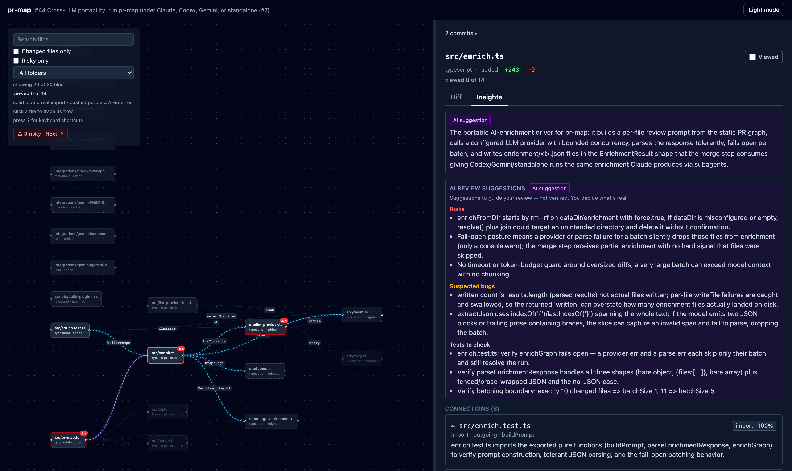
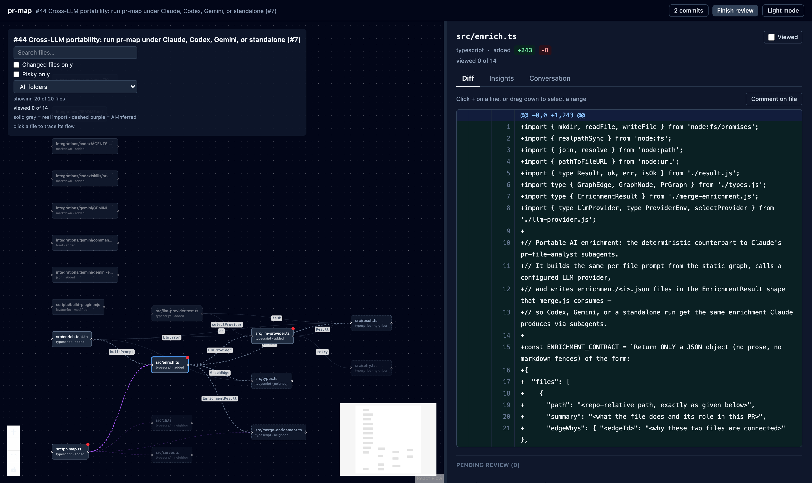

# pr-map

Turn a GitHub pull request into an interactive map, and review it from your browser.



## The problem

Reviewing a pull request on GitHub gets hard the moment it touches more than a few
files. You get a long, flat list of diffs and lose the structure: which files depend
on which, where the risky parts are, what a change might break two files over. You
scroll, and you hold the whole shape of the change in your head.

## What pr-map does

pr-map turns a PR into a **map** plus a **review workspace**:

- A **graph** of the files the PR changes and how they connect — real import edges plus
  the one-hop neighbors a change touches, so you can see its blast radius.
- **AI review notes** on each file: a plain-language summary, the reason two files are
  connected, and review hints (risks, suspected bugs, tests to check, impact). Edges the
  static scan missed are inferred and drawn separately.
- A local **dashboard** where you read each diff, leave line / range / file / PR
  comments and GitHub suggestions, and submit a verdict.

Every read and every review action goes through your already-authenticated `gh` CLI —
no API keys, no token management. And the AI only ever *suggests*: it never approves,
never posts, and never decides. The review is yours.

It runs as a **Claude Code** plugin (Claude does the AI step, so there is nothing to
configure), and the same engine runs under **Codex, Gemini CLI, or standalone** with a
swappable model.

## Quickstart (Claude Code)

You need an authenticated `gh` CLI (`gh auth status`), Claude Code, and to be inside a
local checkout of the PR's repository.

Install the plugin from a clone of this repo:

```
claude plugin marketplace add .
claude plugin install pr-map@pr-map --scope user
```

Then, from inside a checkout of the PR's repository:

```
/pr-map <url|number>
```

With no argument it defaults to the PR for the current branch. That is the whole flow —
pr-map checks the PR out, builds the graph, enriches it, and opens the dashboard.

The installed plugin is self-contained: its bundled scripts run with plain `node` from
`${CLAUDE_PLUGIN_ROOT}/dist`. There is no `npm install` step to use it.

## How it works

Four stages run in order:

```
build the graph  ->  add AI insights  ->  merge them in  ->  open the dashboard
```

1. **Build the graph.** Each changed file becomes a node; an import scanner draws the
   edges; one-hop neighbors (unchanged files that talk to the changed ones) are pulled in.
2. **Add AI insights.** Each file gets a summary, the "why" of each connection, review
   insights, and any semantic edges the static scan missed. AI-added edges are tagged
   `origin: "llm"`; static edges keep `origin: "static"`.
3. **Merge** the insights into the graph.
4. **Open the dashboard** in your browser.

Three of the four stages are plain, deterministic `node` scripts (no model). Only "add
AI insights" uses a language model — which is the one piece that swaps per runtime.



## Use outside Claude Code (Codex, Gemini, or standalone)

Only the AI enrichment step is Claude-specific; the rest is plain `node`. The bundled
engine runs under any coding agent — or standalone with no agent — using a swappable LLM
provider (local Ollama by default, any OpenAI-compatible endpoint optional). Run the
whole pipeline with one command:

```
node "$PRMAP_HOME/pr-map-plugin/dist/pr-map.js" <url|number>
```

See [`integrations/README.md`](integrations/README.md) for setup, the `PRMAP_LLM_*`
provider table, and the Codex skill and Gemini extension wrappers.

## Dashboard features

- Import graph of the changed files and their one-hop neighbors, with folder and risk
  filters, search, and click-to-focus on a node.
- GitHub-style diff with single-line, multi-line range, file, and PR-level comments,
  shown as inline threads.
- GitHub suggested changes: propose exact replacement text on a line or range.
- The PR's existing conversation (inline review comments and PR-level comments), read-only.
- Resolve and unresolve review threads.
- CI/checks status badge for the PR's head commit, and the PR's commit list.
- Mark-file-as-viewed progress, persisted per PR across reloads.
- AI enrichment (summaries, insights, inferred edges) clearly framed as suggestions, not
  verdicts.
- Dark and light theme.
- Submit a verdict: Approve, Request changes, or Comment.

## Reviewing

Comments have three scopes:

- **Line / range** — click the `+` on a diff line, or drag down the line numbers to
  select a range, then write the comment. Use **Suggest change** to propose exact
  replacement text as a GitHub suggestion.
- **File** — a whole-file comment, added from the file's panel.
- **PR** — a general comment on the pull request as a whole.

Comments collect into a pending review. You can delete a pending comment before
submitting, and reply to an existing thread by its GitHub comment id. When you submit a
verdict (Approve / Request changes / Comment), line and file comments post together with
the verdict; PR-level conversation comments and replies post immediately. Submitting is
always an explicit action you take in the UI — pr-map never submits on your behalf.

You cannot Approve or Request changes on your own PR — GitHub rejects self-reviews of
that kind. Use Comment instead when reviewing a PR you authored.

## Ask a local model about the code (optional)

While reading a diff you can ask a small **local** model about a specific line, without
leaving the dashboard. It is fully local and entirely optional — nothing about it is
required to review a PR.

**Prerequisites.** Install llama.cpp so its `llama-server` binary is on your `PATH` — on
macOS, `brew install llama.cpp` — and drop one or more GGUF model files under `~/models`.
pr-map scans that directory recursively; set `PRMAP_MODELS_DIR` to scan a different one.
Files whose name starts with `mmproj-` (vision projectors) are skipped, so only chat
models are listed.

You do not manage the server. pr-map discovers the models it finds there, and when you
pick one it spawns a local `llama-server` bound to `127.0.0.1` for that GGUF, swapping to
a different server when you choose a different model. That spawned `llama-server` now
stays warm after pr-map exits: a later run of the same model adopts the running server
instead of cold-loading the GGUF again, so it is ready almost instantly. Choosing a
different model still swaps it. Set `PRMAP_KEEP_MODEL=0` to have each run stop its server
on exit instead, and to stop a warm server yourself run `pkill llama-server`.

**Using it during review.** Hover a diff line and click the model icon in the gutter (next
to the `+` comment button; its tooltip reads "Ask a local model about this line"). A popup
opens anchored to that line with the selected code as context. Type a question and Send —
the chat is multi-turn, and a dropdown in the popup header switches models. These
conversations are local-only and ephemeral: they are not saved with the review.

If llama.cpp is not installed, no `llama-server` can start, so asking a question fails and
the popup shows an amber setup note with a copyable `brew install llama.cpp` command.

## Data and .gitignore

pr-map writes its working data under the target repository at
`.pr-map/<owner>-<repo>-<number>/` (`graph.json`, `raw.json`, the `enrichment/`
directory, and `pending-review.json`). Add `.pr-map/` to the target repo's `.gitignore`
so this per-PR data is never committed:

```
echo ".pr-map/" >> .gitignore
```

## Troubleshooting

**Dashboard server stopped or closed.** The server is stopped automatically when the
Claude Code session ends (the plugin's `SessionEnd` cleanup hook). To relaunch it against
existing data without rebuilding the graph:

```
node "$CLAUDE_PLUGIN_ROOT/dist/server.js" <dataDir>
```

`<dataDir>` is the `.pr-map/<owner>-<repo>-<number>/` directory printed when the graph
was built. The server listens on `http://localhost:5598` (or the next free port).

**`gh` errors when fetching the PR or posting a review.** Run `gh auth status` and confirm
you are authenticated for the right host. Both PR data and review actions go through `gh`.

**Graph shows isolated nodes.** Static edges are detected by import rules that cover
JavaScript/TypeScript, Python, Go, Java/Kotlin, Ruby, and Rust. Files in other languages
have no static edges and may appear isolated; they rely on AI-suggested edges (tagged
`origin: "llm"`) to connect them.

## Development

For working on pr-map itself (not required to use it):

```
npm run typecheck      # tsc --noEmit
npm run lint           # eslint
npm test               # vitest
npm run build:plugin   # build the dashboard and bundle the plugin into pr-map-plugin/
```

`build:plugin` builds `dashboard/` and bundles the runtime into self-contained `node`
scripts under `pr-map-plugin/dist` plus the dashboard under `pr-map-plugin/dashboard-dist`,
which is what the installed plugin runs.

## License

MIT — see [`LICENSE`](LICENSE).
